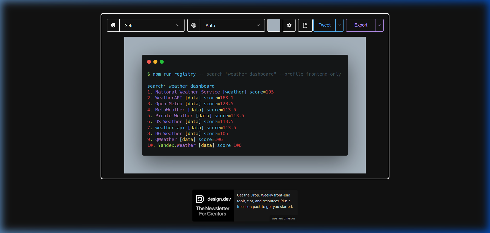
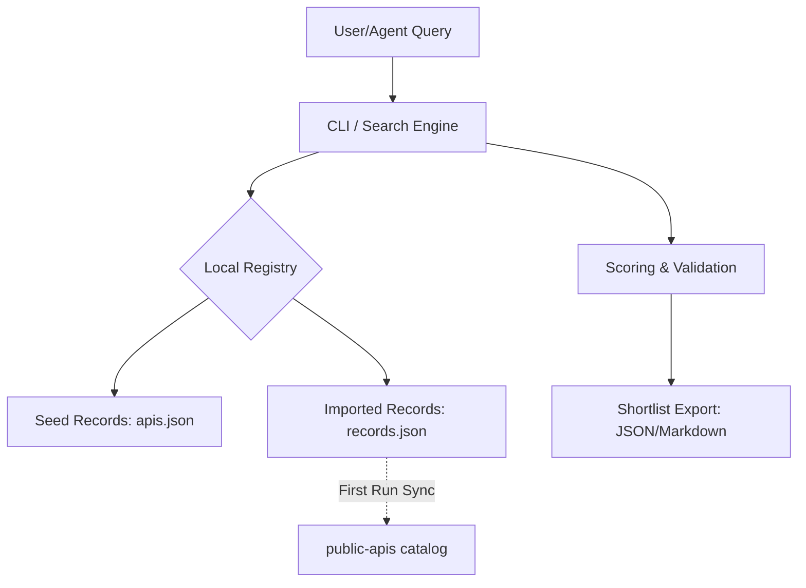

<div align="center">

# API Registry for Claude Code

**Turn an app idea into a ranked, evidence-backed API shortlist before you write code.**



[](https://nodejs.org/)
[](https://www.typescriptlang.org/)
[](https://vitest.dev/)
[](LICENSE)

</div>

---

## Problem

AI app builders need reliable public API choices before implementation starts.
Public API lists are useful, but they rarely answer the question that actually matters:

> **Which API fits this frontend prototype, dashboard, automation, or production app — right now?**

## Value proposition

API Registry is a **local recommendation engine** for app planning. It turns a vague idea
into a ranked, reusable API shortlist — scored dynamically by keyword relevance,
CORS support, auth complexity, and data freshness.

On first run, it auto-imports the full `public-apis` catalog from GitHub. It then
maintains this state locally, allowing you to find, rank, and export normalized
API metadata for Claude Code or any other AI agent — even when offline.

---

## Quick start

### Requirements
- **Node.js 18 or later** ([Download here](https://nodejs.org/))
- **Git**

1. Clone and install: `git clone https://github.com/lunaticbugbear/api-registry.git && cd api-registry && npm install`.
2. Search: `npm run registry -- search "anime app" --profile frontend-only`.
3. First run auto-imports the full public-apis catalog; offline runs fall back to bundled curated seed records.

> [!IMPORTANT]
> First run downloads ~1,400 APIs from the `public-apis/public-apis` catalog. This usually takes 5–10 seconds depending on your connection. After that, searches are near-instant and work offline.

---

## Core Concepts

### Profiles: Choosing your target
The registry filters results based on *how* you are building your app.

| Profile | Filters & Scoring Behavior |
|---|---|
| `frontend-only` | **Strict.** Rejects all APIs without CORS support. |
| `backend-required` | **Server-side.** Permits APIs that require private keys. |
| `prototype` | **Fast.** Prioritizes APIs with "Free" pricing and no auth. |
| `production` | **Stable.** Prioritizes "Trusted" status and high-uptime providers. |
| `automation` | **Headless.** Prioritizes simple JSON APIs with high rate limits. |

### The Scoring Engine
Every result is ranked by a multi-factor engine (not just keyword matching):

- **Relevance (60%)**: Semantic match across name, description, tags, and category.
- **Runtime Fit (20%)**: Compatibility boost based on your chosen `--profile`.
- **Trust Signal (20%)**: Bonuses for trusted status, high confidence evidence, and freshness.
- **Penalty System**: Points deducted for missing docs, unknown CORS, or stale data.

---

## Demo transcript

```bash
$ npm run registry -- search "weather dashboard" --profile frontend-only
search: weather dashboard
1. National Weather Service [weather] score=195
2. WeatherAPI [data] score=163.1
3. Open-Meteo [data] score=128.5
4. MetaWeather [data] score=113.5
5. Pirate Weather [data] score=113.5
...

$ npm run registry -- export "weather dashboard" --format json
```

See [examples/weather-dashboard.json](examples/weather-dashboard.json) for the full export output.
For the generated full demo, see [examples/demo-transcript.md](examples/demo-transcript.md).

---

## Command reference

| Command | Purpose | Example |
|---|---|---|
| `add` | Validate and add one API record JSON file. | `npm run registry -- add api.json` |
| `search` | Rank APIs by query, profile fit, confidence, freshness, and completeness. | `npm run registry -- search "anime app" --profile frontend-only` |
| `import` | Import APIs from public-apis or a local markdown export. | `npm run registry -- import public-apis` |
| `refresh` | List stale records that need re-checking. | `npm run registry -- refresh` |
| `audit` | Validate registry quality and health metadata. | `npm run registry -- audit` |
| `export` | Produce JSON or Markdown for another skill or agent. | `npm run registry -- export "weather dashboard" --format json` |

---

## Use it with AI agents

Think of API Registry as a helper your AI coding agent can call before choosing an API.

### Fastest setup: Copy-paste this into your agent
Paste this into Claude Code, Codex, Cursor, or Gemini:

```text
Use this project as an API Registry tool.
Before choosing any third-party API, always run:
  npm run registry -- search "{app idea}" --profile "frontend-only"
Then prefer the recommended APIs. Check warnings before implementation.
```

### Claude Code (Deep Integration)
Tell Claude to use the skill definition:
```text
Use skills/api-registry/SKILL.md whenever I ask you to research APIs.
Before implementing any API, search the local registry first.
```

---

## Architecture



---

## Documentation

- [Install guide](docs/install.md)
- [Schema reference](docs/schema.md)
- [Command reference](docs/commands.md)
- [Agent contract](docs/agent-contract.md)
- [Release checklist](docs/release-checklist.md)

---

## Contributing

See [CONTRIBUTING.md](CONTRIBUTING.md).

### Add your first API
Help us grow the trusted seed set. Create a JSON file (e.g., `my-api.json`):

```json
{
  "id": "my-awesome-api",
  "name": "My Awesome API",
  "description": "Provides real-time data for X.",
  "category": "Data",
  "auth": "apiKey",
  "cors": "yes",
  "pricing": "free",
  "status": "trusted",
  "updatedAt": "2026-05-14T07:55:31Z"
}
```

Then run: `npm run registry -- add my-api.json` and submit a Pull Request!

---

## License

MIT — see [LICENSE](LICENSE).
